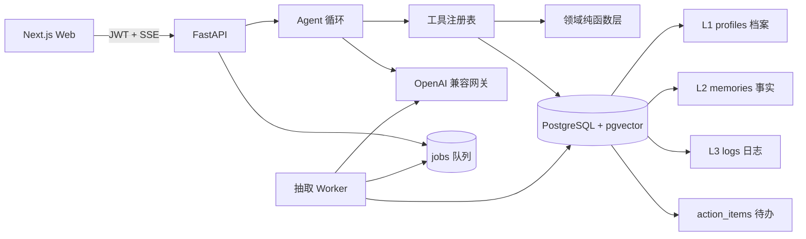

# FitMind AI · 有记忆的健身助理

一个具备长期记忆的全栈 AI 个人助理。用户用自然语言对话，助理会维护档案、召回长期事实、
把自己给出的建议沉淀成可勾选的待办、查询训练日志、生成增力/减脂周期，并按居家、办公室
或外食场景给出配餐。所有数字都来自确定性函数，不由模型口算。

- 前端：Next.js 16 + React 19 + Tailwind + Zustand
- 后端：FastAPI + SQLAlchemy 2 异步 + PostgreSQL 16 + pgvector
- 模型：OpenAI 兼容网关（对话 + embedding），支持配置备用模型

---

## 目录

- [快速开始](#快速开始)
- [Demo 剧本](#demo-剧本)
- [架构总览](#架构总览)
- [考察点对照](#考察点对照)
- [记忆系统设计](#记忆系统设计)
- [上下文管理与 Token 控制](#上下文管理与-token-控制)
- [工具调用](#工具调用)
- [不确定输出的兜底与降级](#不确定输出的兜底与降级)
- [用户数据隔离与隐私](#用户数据隔离与隐私)
- [API 接口](#api-接口)
- [项目结构](#项目结构)
- [本机开发](#本机开发)
- [测试](#测试)
- [环境变量](#环境变量)
- [已知限制](#已知限制)

---

## 快速开始

只需要 Docker Desktop / Docker Engine 与 Compose。

```bash
cp .env.example .env    # 编辑：填写模型服务，并按自己的环境调整端口
./start.sh
```

打开 <http://localhost:3000>，用 `demo@fitmind.cn` / `demo123456` 登录。

`start.sh` 会依次：检测 Docker 与 Compose 命令形态（新版子命令与旧版独立版都支持）→
校验 `.env` 配置项 → 构建并启动全部服务 → 等 API 健康检查通过（含数据库迁移）→
灌入演示数据 → 打印访问地址。脚本幂等，重复执行安全。首次没有 `.env` 时它会
自动从 `.env.example` 生成并告诉你要填哪三项。

```bash
./start.sh --no-build   # 没改代码，只重启（更快）
./start.sh --no-seed    # 不灌演示数据
./start.sh --help
```

| 服务 | 默认地址 | 在自己的环境中如何修改 |
|---|---|---|
| Web | <http://localhost:3000> | `.env` 中改 `WEB_PORT` |
| API | <http://localhost:8000> | `.env` 中改 `API_PORT` |
| API 文档 | <http://localhost:8000/docs> | 随 `API_PORT` 自动变化 |
| PostgreSQL | `localhost:5433` | `.env` 中改 `POSTGRES_PORT`；只在需要用数据库客户端直连时使用 |

### 给其他使用者的配置说明

拿到源码后，每个人都应在**自己的电脑**创建 `.env`；这个文件不纳入 Git 或发布包，
因此不会包含你的模型密钥或本机端口。

1. 复制模板：`cp .env.example .env`。
2. 填写自己的 `LLM_BASE_URL`、`LLM_API_KEY`、`LLM_MODEL`，并用
   `openssl rand -hex 32` 生成自己的 `JWT_SECRET`。
3. 若默认端口被占用，修改 `WEB_PORT`、`API_PORT`、`POSTGRES_PORT`。例如：

   ```dotenv
   WEB_PORT=3100
   API_PORT=8100
   POSTGRES_PORT=5434
   NEXT_PUBLIC_API_BASE=http://localhost:8100/api/v1
   CORS_ORIGINS=http://localhost:3100,http://127.0.0.1:3100
   ```

   前端 API 地址和 CORS 必须与改后的 Web/API 端口对应；`NEXT_PUBLIC_API_BASE`
   在前端构建时写入，所以改完端口后需要运行不带 `--no-build` 的 `./start.sh` 重新构建。
4. 运行 `./start.sh`。脚本会使用 `.env` 中的端口检查冲突，并在完成后打印实际访问地址。

如果部署到服务器或用域名访问，把 `NEXT_PUBLIC_API_BASE` 改为浏览器可访问的 API 地址
（例如 `https://assistant.example.com/api/v1`），并把站点地址加入 `CORS_ORIGINS`。不要把
`.env`、任何 API Key 或导出的数据库数据提交到仓库或发送给他人。

### 生成可分发源码包

在仓库根目录运行 `./package-source.sh`，会在仓库根目录生成 `FitMind-AI-source.zip`。解压后会得到
独立的 `FitMind-AI-source/` 项目目录。该包会保留
源码、Docker 配置、`.env.example` 和文档，但主动排除 `.env`、Git 历史、依赖目录、构建
缓存、日志、个人图片和题目附件。把 ZIP 发给对方后，对方按上面的「给其他使用者的配置说明」
创建自己的 `.env` 即可运行。

数据库迁移不需要手动执行——`server` 容器的启动命令是
`alembic upgrade head && uvicorn ...`，每次启动自动推到最新版本。

**改了代码必须重建镜像**：三个服务都把源码打进镜像，`web` 还把
`NEXT_PUBLIC_API_BASE` 作为构建参数烧进产物。`./start.sh`（不带 `--no-build`）
和 `make up` 都已带 `--build`。

### Makefile

`Makefile` 收了日常命令，`make` 或 `make help` 看全部：

```bash
make up            # 等价于 docker-compose up -d --build
make logs-worker   # 只看 worker（排查待办/记忆抽取时用这个）
make ps            # 容器状态
make down          # 停止服务，保留数据卷
make test          # 后端全量测试
make check         # 后端测试 + 覆盖率 + 前端类型检查与构建
make clean         # 清理构建产物
```

装的是新版 Compose 插件时，用 `make COMPOSE="docker compose" up` 覆盖即可。

---

## Demo 剧本

登录演示账号后依次输入：

1. `卧推 80kg 5x5` — 快路径直接落库，不经过模型，几十毫秒返回训练卡片。
2. `我不吃香菜，工作日午饭在公司解决` — 抽取为长期事实；若模型推断出敏感字段
   （目标、伤病）会先征询确认再写入。
3. `按 82kg、TDEE 2770 帮我做 8 周碳循环减脂计划` — 返回减脂卡片与周变化率。
4. `办公室午饭怎么配？` — 自动读取上一步记住的场景与忌口生成配餐。
5. `我想一边快速减脂一边刷新卧推 PR` — 返回目标冲突判定与可点击的备选方案。
6. 长回复生成过程中点击**停止**按钮 — 立即中断，已生成的半句保留并标注「已停止」。
7. 右侧面板切到**待办** — 第 3、4 步里助理提出的建议已经异步沉淀成可勾选事项。
   点条目上的「来源」会滚动高亮回原始那条助理消息。

待办是异步抽取的（worker 2 秒轮询），聊完等 2–5 秒再刷新面板。

---

## 架构总览



三条设计主线：

**读写分层。** 日志永远不进 prompt，只能由工具聚合查询；事实必须低于余弦距离阈值
才召回；档案每轮全量注入。三条通道刻意不混，避免"把所有能查到的都塞进上下文"。

**计算不交给模型。** 所有数字（TDEE、营养素克数、1RM、周期重量、距目标天数）
都由 `core/domain/` 下的纯函数算出。模型只负责理解意图、编排工具、组织语言。

**异步旁路不影响主链路。** 事实抽取和待办抽取都在回复发送**之后**投递到
PostgreSQL 队列，由独立 worker 消费。抽取失败、模型抽风、判重出错，都不会影响
用户已经看到的那次回复。

---

## 考察点对照

| 考察方向 | 实现要点 | 主要位置 |
|---|---|---|
| 记忆写入时机 | 回复完成后异步投递，中断的回合不投递 | `services/chat_service.py` |
| 记忆存储结构 | L1 档案 JSONB / L2 事实 + 向量 / L3 结构化日志 / 待办独立表 | `models/`, `alembic/versions/` |
| 记忆检索策略 | 距离阈值召回而非纯 top-k；档案全量；日志只走工具 | `core/memory/facts.py` |
| 上下文管理 | 三段式历史压缩 + 缓存友好的 message 排序 | `core/agent/context.py` |
| Token 控制 | 预算估算 + 历史 token 上限 + 每轮日志记录预算构成 | `core/agent/context.py` |
| 工具注册与路由 | 装饰器注册表 + JSON Schema 校验 + 快路径绕过模型 | `core/tools/registry.py`, `core/agent/fast_path.py` |
| 工具稳定性 | 单工具超时、异常隔离、结果结构化 | `core/tools/registry.py`, `core/agent/loop.py` |
| 兜底与降级 | L0–L5 六级阶梯，最后一级不依赖模型 | `core/agent/loop.py`, `core/agent/rule_fallback.py` |
| 不稳定输出处理 | JSON 解析容错 + 判定调用重试 + 置信度阈值丢弃 | `core/llm/judge.py`, `core/memory/extractor.py` |
| 用户数据隔离 | PostgreSQL 行级安全 + 三角色分离 + JWT | `scripts/init_db.sql`, `core/database.py` |
| 接口设计 | REST + SSE 流式，OpenAPI 自动生成前端类型 | `api/v1/` |
| 可扩展性 | 新增工具一个装饰器；新增记忆类型一个 job handler | `core/tools/registry.py`, `core/jobs/worker.py` |
| 输出安全 | 内部标识符三层拦截：提示禁令 + 反馈用人话 + 流式脱敏 | `core/agent/scrub.py`, `core/agent/glossary.py` |
| 测试与质量 | 567 个测试，93% 覆盖率，迁移往返验证 | `tests/` |

---

## 记忆系统设计

### 四类记忆，各有各的通道

| 层 | 存什么 | 写入时机 | 如何进入 prompt |
|---|---|---|---|
| **L1 档案** | 身高体重年龄、目标、活动系数、伤病、忌口 | 工具显式写入，敏感字段先征询 | 每轮全量注入 |
| **L2 事实** | 稳定的用户特征（偏好、场景、成绩、限制） | 回复后异步抽取 | 按向量相关度召回，有距离阈值 |
| **L3 日志** | 训练记录、体重曲线 | 工具写入（含快路径） | **永不注入**，只能由工具聚合查询 |
| **待办** | 助理提出的、用户要去做的事 | 回复后异步抽取 | **永不注入**，只在面板消费 |

L3 不进 prompt 是有意的：日志是会无限增长的时间序列，塞进上下文既爆 token 又
让模型去做它算不准的聚合。待办也不进 prompt——否则模型会把自己上一轮的建议
当成既定事实复述。

### 写入时机：宁可漏记，不可错记

抽取在回复发送之后异步执行，用户无感知。三道闸门：

1. **置信度阈值**：低于 0.7 直接丢弃（`extractor.py` 的 `MIN_CONFIDENCE`）。
2. **中断不抽取**：用户点了停止的回合，一条抽取任务都不投递。从半句话里抽长期
   事实会污染记忆库，抽待办更糟——会变成用户根本没读完的待跟进事项。
3. **敏感字段先征询**：模型推断出的目标、伤病不直接落库，先返回确认话术。
   `update_profile` 工具的 `confirmed` 参数控制这个语义。

### 检索策略：阈值而非 top-k

```
MAX_RECALL_DISTANCE = 0.55   # 召回"相关内容"
SIMILARITY_THRESHOLD = 0.35  # 冲突消解判定"同一件事"
CANDIDATE_DISTANCE = 0.45    # 待办判重的候选粗筛门
```

只取 top-k 会有个隐蔽问题：没有阈值时，**无关记忆也必然会占满 k 个位置**。
实测相关事实的余弦距离约 0.31，无关内容从约 0.69 起，中间有明显间隔，
所以 0.55 能干净切开。

### 冲突消解：旧事实不删，用失效指针串联

新事实与已有事实距离低于 0.35 时，调 LLM 判定四种关系之一：

| 关系 | 处理 |
|---|---|
| `supersede` | 新的与旧的矛盾 → 旧的 `superseded_by` 指向新的 |
| `update` | 同一件事、新的更完整 → 同上 |
| `duplicate` | 完全同义 → 不新增 |
| `independent` | 两件事 → 各自保留 |

物理上不删除，便于追溯助理当初为何做出某个判断。用户主动删除才真删。

### 待办判重：为什么向量单独不够

待办的去重比事实更难，因为教练建议高度模板化。实测同一条卧推加重建议
与其他建议的余弦距离：

| 距离 | 内容 | 应判定 |
|---|---|---|
| 0.088 | 卧推工作重量提到 82.5kg | 重复 |
| 0.129 | 把卧推的重量加上去到 82.5 | 重复 |
| 0.254 | 把**深蹲**工作重量加到 120kg | **不同** |
| 0.314 | 下周把卧推加到 82.5 **公斤** | 重复 |
| 0.742+ | 蛋白补到 140g / 每晚早睡 / 买乳清蛋白 | 不同 |

关键是 **0.254 < 0.314**：「同模板不同动作」比「同动作不同说法」更近，两类样本
区间重叠，**不存在能分开它们的阈值**。误判方向也很糟——深蹲的建议会被卧推的
悄悄吞掉，用户永远不知道助理提过。

所以向量只负责把 0.742 那一档排除掉（`CANDIDATE_DISTANCE = 0.45`），剩下的
候选交给 LLM 判定同异。这几个实测数字在 `tests/test_actions.py::TestThresholdGeometry`
里被钉成断言，谁想把阈值收紧当判重线用会先让测试失败。

待办判重只跟未结项比较：`done` 代表已完成，同类建议下个周期再提是合理的；
`ignored` 代表用户明确不要，必须参与判重，否则再提就是骚扰。

### 可追溯、可编辑、可删除

- 事实、待办都记录来源消息 id，面板上可以点回原对话
- 档案在面板里表单式直接编辑，改完回写
- 事实和待办都能删除
- 待办额外支持三态流转：`pending` / `done` / `ignored`，可以重新打开

---

## 上下文管理与 Token 控制

### message 排序即缓存策略

Prompt 缓存是**前缀匹配**，前面变一个字节后面全部失效。所以顺序固定为：

```
1. 系统提示        ← 恒定，作为缓存前缀
2. 档案 + 今天日期 + 召回事实   ← "今天是几号"每天变，必须放在缓存断点之后
3. 压缩后的历史
4. 当前用户消息    ← 永远最后
```

把 `今天是 X 月 X 日` 写进系统提示是个常见错误：它每天变一次，会让整个前缀
每天全部失效。

### 三段式历史压缩

`compress_history()`：最近 6 轮原样保留，更早的在超出 3000 token 预算时
从最旧开始丢弃。

敢丢历史的前提是记忆系统已经把该记的抽到 L2 了——历史只负责短期连贯性，
长期记忆是另一套机制。**两个机制缺一个，另一个就跛脚**：只压缩不记忆会失忆，
只记忆不压缩会爆上下文。

### 预算可观测

每轮日志记录一行预算构成，便于定位是哪一块在膨胀：

```
上下文预算 total=385 system=342 profile=25 history=6
```

估算用 `estimate_tokens()`（中文约 1 字 1 token，其余约 4 字符 1 token）。
只用于预算控制，精确值由 API 返回的 `usage` 记录到 `llm_usage` 表。

---

## 工具调用

### 铁律：所有计算走工具

模型算 TDEE 会错，算营养素克数会错，算「距目标还有多少天」更会错，而且错得
很自信。在健身场景这是致命的——吃错热量，一个月白练。

所以划一条硬线：**模型只负责理解意图、编排工具、组织语言；所有数字来自
`core/domain/` 下的确定性纯函数。** 这不是等它错了再兜底，而是从一开始
不给它算错的机会。

### 15 个工具

| 类别 | 工具 |
|---|---|
| 计算 | `calc_energy_baseline` `calc_macros` `estimate_one_rm` `project_goal` |
| 计划生成 | `plan_strength_cycle` `plan_cut_phase` `plan_meals` `check_plan_conflict` `get_plan_detail` |
| 记录（写 L3/L1） | `log_workout` `log_body_metric` `update_profile` |
| 查询 | `query_workout_history` `query_body_trend` `search_food` |

### 注册与路由

新增一个工具只需要一个装饰器——注册表自动生成 JSON Schema 交给模型，
并在调用时校验参数：

```python
@tool(name="calc_macros", label="计算营养素分配", description="...")
async def calc_macros(args: CalcMacrosArgs, ctx: ToolContext) -> dict:
    ...
```

`label` 是这个工具的**用户可见**说法，必填。`name` 只在系统内部流转：前端状态行、
失败反馈、流式脱敏一律用 `label`（见下节）。

### 稳定性处理

- **快路径**：`卧推 80kg 5x5` 这类明确的记录意图由正则直接命中工具，
  全程不碰模型，几十毫秒返回。既省钱又快，还绕开了模型可能的误解。
- **单工具超时**：`AGENT_TOOL_TIMEOUT_S`（默认 3 秒），超时不拖死整轮。
- **参数校验**：Schema 不匹配抛 `ToolValidationError`，把错误回喂给模型让它改，
  而不是直接失败。
- **幂等**：`client_message_id` 去重，同一条消息重复提交只处理一次；
  日志写入也做了重复检测。

### 内部名字不出现在回复里

内部标识符曾经从三个口子漏到用户眼前：模型自己写出 `` `plan_strength_cycle` ``；
注入提示的档案是 JSON，`weight_kg`、`cut`、`office` 被模型照抄；前端状态行对
未登记的工具直接显示「正在调用 calc_energy_baseline…」。

用户看不懂这些名字，看到只会觉得系统在漏东西。所以堵在三层，缺一层都不够：

| 层 | 做法 | 位置 |
|---|---|---|
| 输入侧 | 档案按中文名 + 中文取值渲染，模型手上没有内部名字可抄 | `core/agent/context.py`, `core/agent/glossary.py` |
| 反馈侧 | 工具失败反馈说 `label` 不说 `name`，并明写"不要转述"；征询语、降级文案同样用中文字段名 | `core/agent/loop.py`, `core/agent/rule_fallback.py` |
| 输出侧 | 流式脱敏：把词表内的标识符换成人话，词表外的记日志 | `core/agent/scrub.py` |

系统提示里也有一条硬性规则禁止这么说，但提示只是"要求"——**"绝不泄漏"是产品
承诺，得有一层确定性代码来兑现**，那一层就是输出侧脱敏。

脱敏的难点全在流式：`log_workout` 会被切成任意几段吐出来，逐段替换必然漏。
做法是**先按边界扣住可能没写完的尾巴，再替换已经确定的部分**——顺序反了就会把
`log_workout_v2` 的前半截当成 `log_workout` 换掉。回合结束必须 flush，
否则以标识符结尾的回复会被吞掉一截。

词表从注册表现取，新增工具仍然是"新增一个文件、别处零改动"；`@tool` 的 `label`
必填，漏了直接报错，而不是悄悄退化成显示内部名。

---

## 不确定输出的兜底与降级

### 六级降级阶梯

```
L0 正常     主模型 + 完整工具
L1 重试     同模型退避重试
L2 换模型   切到 LLM_FALLBACK_MODEL
L3 缩范围   只保留核心工具，减少模型出错面
L4 规则兜底 完全不依赖模型，结果来自领域纯函数
L5 诚实失败 明确告知，保留用户输入
```

前端会在回复下方标注本次启用了第几级，不静默降级。

`LLM_FALLBACK_MODEL` 建议选与主模型**不同厂商或架构**的模型，降低同源故障
概率；留空则跳过 L2。

**空输出也算失败。** 推理模型的思考 token 与正文共享 `max_tokens`，预算耗尽时
返回的是 HTTP 200 + 空正文 + `finish_reason=length`，不是报错。当成"这轮说完了"
处理，用户看到的就是工具跑完了、档案也写了，回答却停在"先把你的档案建好"然后
没有下文——比报错更难查。所以 `with_fallback.py` 把"一个字和一个工具调用都没
产出"的尝试判为失败，交给 L1/L2/L3 重试；此时下游还没收到任何内容，重试不会
重复输出。同理，异步抽取拿到空输出时**抛异常交给 job 队列按退避重试**，而不是
当成"这轮没有可记的事实"——后者会让记忆功能静默退化成"从不记忆"。

### 判定调用的重试

这是一个踩过坑才发现的问题：**推理模型在 token 预算不足时返回空字符串，
而不是报错。** 实测同一对输入：

```
max_tokens=  64 → ''
max_tokens= 128 → ''
max_tokens= 512 → '{"relation": "update"}'
max_tokens=1024 → ''
max_tokens=2048 → '{"relation": "update"}'
```

注意 1024 返回空而 512 有结果——**思考长度有方差，调大数字治不了本，必须重试。**

危险在于失效是静默的：调用方通常有个 `except` 兜底，于是功能悄悄退化成
「从不判定」，日志里一行报错都没有。`core/llm/judge.py` 把重试、空输出检测、
JSON 解析容错收在一处，记忆冲突消解和待办判重共用。判定彻底失败时抛
`JudgeError` 而不是返回默认值，让调用方显式选择降级方向。

### 抽取输出的容错

- 代码块围栏（```json）自动剥离
- **空输出**（思考预算耗尽）抛异常，由 job 队列退避重试——它和"确实没有可记的
  事实（`[]`）"是两件事，混为一谈等于静默失效
- JSON 解析失败记警告后跳过本次，不让异步 job 炸掉
- 非法 category 落到 `general`，置信度裁剪到 [0, 1]
- 单轮待办上限 3 条：模型无视 `max_items` 是常事，一轮冒出十条待办面板就没法用了

---

## 用户数据隔离与隐私

### PostgreSQL 行级安全（RLS）

隔离在**数据库层**，不靠应用层每个查询记得加 `WHERE user_id = ?`。
所有租户表启用 `FORCE ROW LEVEL SECURITY`：

```sql
CREATE POLICY tenant_isolation ON <table>
USING (user_id = NULLIF(current_setting('app.user_id', true), '')::uuid)
WITH CHECK (user_id = NULLIF(current_setting('app.user_id', true), '')::uuid)
```

请求进来时把 JWT 里的 user_id 绑到会话变量 `app.user_id`。忘记加 WHERE 条件
不会导致数据泄露——策略在数据库侧强制生效。

### 三角色分离

| 角色 | 权限 | 用途 |
|---|---|---|
| `fitness_admin` | 表所有者 | 迁移 |
| `fitness_app` | 受 RLS 约束 | API 服务 |
| `fitness_worker` | `BYPASSRLS` | worker 跨用户领取 jobs |

worker 必须跨用户读队列，所以需要独立角色，但它执行每个 job 时会**显式绑定
该 job 的用户**再操作数据，不是敞开跑。

`tests/test_rls_isolation.py` 专门验证连接池复用时会话变量不泄露——
这类 bug 只在连接被复用时才暴露。

### 其他

- 密码 bcrypt 哈希
- JWT 承载 user_id，`JWT_SECRET` 要求至少 32 字符（配置层强校验）
- 记忆、待办、档案全部用户可见、可删除
- 删除用户级联删除全部数据（外键 `ON DELETE CASCADE`）

---

## API 接口

全部前缀 `/api/v1`，除注册登录外都需要 `Authorization: Bearer <token>`。
完整 OpenAPI 文档在 <http://localhost:8000/docs>。

### 认证

| 方法 | 路径 | 说明 |
|---|---|---|
| POST | `/auth/register` | 注册，返回 token |
| POST | `/auth/login` | 登录，返回 token |
| GET | `/me` | 当前用户 |

### 对话

| 方法 | 路径 | 说明 |
|---|---|---|
| POST | `/conversations` | 新建会话 |
| GET | `/conversations` | 会话列表 |
| GET | `/conversations/{id}/messages` | 历史消息（断线重连用） |
| POST | `/conversations/{id}/messages` | **SSE 流式对话** |
| POST | `/conversations/{id}/interrupt` | 中断当前生成 |

SSE 事件类型：`message_start` `text_delta` `tool_start` `tool_result` `card`
`message_done` `interrupted` `error`。

`tool_start` / `tool_result` 只带 `label`（如 `{"label": "查询食物营养"}`）。
内部工具名和调用参数不出网关——前端拿不到，也就没机会显示成
「正在调用 `search_food`…」。

助理消息**先落库再推流**：客户端断连时服务端跑完仍会落盘，重连是「取回已生成的」
而不是「重新生成」。

### 记忆与档案

| 方法 | 路径 | 说明 |
|---|---|---|
| GET | `/profile` | 读档案 |
| PATCH | `/profile` | 改档案（字段白名单校验） |
| GET | `/memories` | 事实列表 |
| DELETE | `/memories/{id}` | 删除事实 |

### 待办

| 方法 | 路径 | 说明 |
|---|---|---|
| GET | `/action-items?status=pending` | 列表，可按状态过滤 |
| POST | `/action-items` | 手动新建（不参与判重） |
| PATCH | `/action-items/{id}` | 流转状态 `pending`/`done`/`ignored` |
| DELETE | `/action-items/{id}` | 删除 |

### 日志与用量

| 方法 | 路径 | 说明 |
|---|---|---|
| POST | `/logs/workouts` | 记录训练 |
| GET | `/logs/workouts` | 训练历史 |
| GET | `/logs/body-metrics` | 体重曲线 |
| GET | `/usage/summary` | Token 用量与调用统计 |
| GET | `/health` | 健康检查（不带前缀） |

前端类型由 OpenAPI 自动生成，**禁止手改** `web/src/types/api.gen.ts`：

```bash
make gen           # 后端需在运行中
```

---

## 项目结构

```
backend/
  app/
    api/v1/            REST + SSE 端点（auth chat memory actions logs usage）
    core/
      agent/           Agent 循环、上下文组装、快路径、规则兜底、系统提示
      domain/          领域纯函数：能量 营养素 力量 配餐 冲突 推算
      tools/           15 个工具 + 注册表
      memory/          L1 档案 / L2 事实 / 抽取 / 冲突消解 / embedding
      actions/         待办：抽取 / 判重 / 持久化
      jobs/            PostgreSQL 队列与 worker
      llm/             provider 抽象、备用模型、用量记录、判定调用
    models/            SQLAlchemy 模型
  alembic/versions/    11 个迁移，全部验证过 upgrade → downgrade → upgrade 往返
  tests/               567 个测试
  scripts/             init_db.sql（角色与 RLS）、seed_demo.py、seed_foods.py

web/src/
  app/                 Next.js App Router
  components/
    chat/              对话视图、消息、输入框（含停止按钮）
    cards/             8 类富卡片渲染
    memory-panel/      档案 / 待办 / 数据 / 训练 四面板
  hooks/useSSE.ts      SSE 流式解析
  stores/chat.ts       Zustand 对话状态
  types/api.gen.ts     OpenAPI 自动生成，勿手改
```

八类富卡片：`workout_logged` `metric_logged` `macros` `projection`
`strength_plan` `cut_plan` `meal_plan` `conflict`。未知卡片类型会降级为
可展开的 JSON，不白屏。

---

## 本机开发

要求 Python 3.12+、Node.js 22+、PostgreSQL 16 + pgvector。

```bash
# 数据库（也可以只起 compose 里的 postgres：make db）
createdb fitness

# 后端
cd backend
python3.12 -m venv .venv
.venv/bin/pip install -r requirements.txt
.venv/bin/alembic upgrade head
.venv/bin/python scripts/seed_foods.py
.venv/bin/uvicorn app.main:app --reload

# 另一个终端：抽取 worker（不起它，待办和长期事实不会出现）
cd backend && .venv/bin/python -m app.core.jobs.worker

# 前端
cd web
npm install
npm run gen        # 后端需在运行中
npm run dev
```

前端默认请求 `http://localhost:8000/api/v1`，可用 `NEXT_PUBLIC_API_BASE` 覆盖。

**注意**：本机开发的库（`.env` 里的 `DATABASE_URL`，默认 `localhost:5432`）
与 Docker 的库（`localhost:5433`）是两套独立数据，迁移要分别执行。

LLM 未配置时不会启动失败——数据库、认证、记录功能正常，对话会走 L4 规则兜底。
启动日志会明确告警。

---

## 测试

```bash
make test          # 567 passed
make cov           # 覆盖率
make check         # 后端测试 + 覆盖率 + 前端 tsc + next build
```

测试需要一个可连接的 PostgreSQL（`tests/conftest.py` 里的默认地址，
或环境变量 `DATABASE_URL`）。测试不依赖 `.env` 文件，也不访问外网——
embedding 与模型调用在单测里都有替身，真实网关只在少数标注过的用例里使用。

当前实测：

| 项 | 结果 |
|---|---|
| 后端测试 | **567 passed** |
| 总覆盖率 | **93%**（2312 statements，154 missed） |
| 领域纯函数模块 | 96–100% |
| 前端 | `tsc --noEmit` 通过，Next.js 16 production build 通过 |
| 迁移 | 11 个，全部验证 upgrade → downgrade → upgrade 往返 |

值得一提的几类测试：

- `test_rls_isolation.py` — 连接池复用时会话变量不泄露
- `test_actions.py::TestThresholdGeometry` — 把「向量单独判不了重」的实测结论钉成断言
- `test_judge.py` — 推理模型返回空输出时的重试行为
- `test_fallback.py` / `test_rule_fallback.py` — 降级阶梯每一级
- `test_chat_interrupt.py` — 中断后不投递抽取任务、历史仍包含被中断的半句
- `test_scrub.py` — 内部标识符被切成任意几段吐出来时仍然脱敏（含逐字节切分）

---

## 环境变量

完整清单见 `.env.example`。必填三项：

| 变量 | 说明 |
|---|---|
| `LLM_BASE_URL` | OpenAI 兼容网关地址 |
| `LLM_API_KEY` | 网关 API Key |
| `LLM_MODEL` | 对话模型名 |

`DATABASE_URL` 和 `JWT_SECRET` 在 `.env.example` 里有可用默认值，
生产环境务必替换 `JWT_SECRET`（`openssl rand -hex 32`）。

其余可调项及默认值：

| 变量 | 默认 | 说明 |
|---|---|---|
| `LLM_FALLBACK_MODEL` | 空 | 备用模型，留空跳过 L2 降级 |
| `LLM_MAX_TOKENS` | 8192 | 单次调用输出上限。**推理模型的思考也算在内**，给小了正文会整段为空；这是上限不是用量 |
| `EMBEDDING_MODEL` | `text-embedding-3-small` | 向量模型 |
| `EMBEDDING_DIM` | 1536 | 必须与向量模型一致，改了要重建索引 |
| `AGENT_MAX_TURNS` | 6 | Agent 循环最大轮数 |
| `AGENT_TOOL_TIMEOUT_S` | 3.0 | 单个工具超时 |
| `AGENT_HISTORY_WINDOW` | 6 | 历史保留轮数 |
| `WORKER_DATABASE_URL` | 空 | worker 专用连接，生产应指向 `BYPASSRLS` 角色 |
| `CORS_ORIGINS` | localhost:3000 | 逗号分隔 |

配置在 `core/config.py` 集中校验，缺失或不合法**启动即失败**，
不会跑到一半才炸。

---

## 已知限制

- 食物营养值用于产品演示，不替代包装标签、营养师或医疗建议。
- 余弦距离阈值基于当前 embedding 模型实测调校，**更换模型后必须重新测量**。
  README 里那几个距离数字就是测出来的，换模型后会失效。
- 待办判重每条候选多一次 LLM 调用，只在向量粗筛命中近邻时发生。
  量大了可以加缓存，目前没做。
- jobs 队列没有「running 超时自动回收」的看门狗；worker 在执行中硬退出时，
  需人工把该任务从 `running` 重置为 `pending`。
- 待办溯源是降级版：目标消息在当前已加载会话里就滚动高亮，不在就展示原文摘录。
  完整的跨会话跳转需要先做会话列表 UI。
- worker 与 server 容器不响应 SIGTERM，`docker-compose stop` 时会等满宽限期
  被 SIGKILL（退出码 137），执行中的 job 会被硬切。
- Docker 首次构建需要访问 Python 与 npm 软件源；模型调用还需要能访问配置的网关。

---

## 文档

- [设计文档](docs/superpowers/specs/2026-08-24-fitness-agent-design.md) — 需求推导与技术选型
- [实现计划 Plan 1](docs/superpowers/plans/2026-08-24-fitness-agent.md) — 领域层、工具、Agent、记忆
- [实现计划 Plan 2](docs/superpowers/plans/2026-08-25-fitness-agent-plan2.md) — 计划工具、前端、交付打磨
