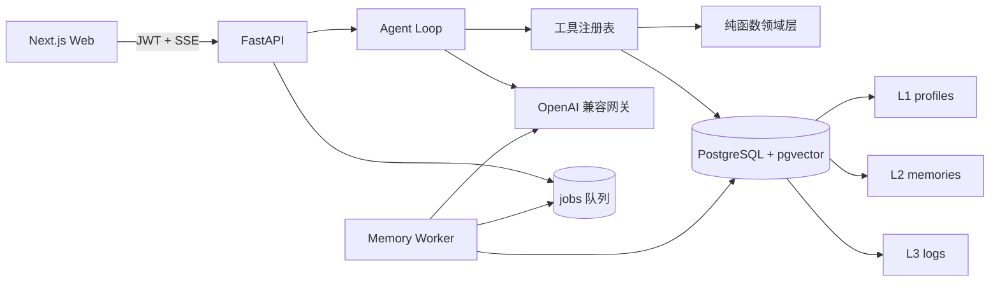

# FitMind AI · 有记忆的健身助理

面向个人训练与营养管理的全栈 AI 助理。它不只回答问题，还会维护用户档案、召回长期事实、查询训练日志、生成增力/减脂周期，并根据居家、办公室或外食场景给出配餐。

## 核心能力

- 三层记忆：L1 档案全量注入、L2 事实向量召回、L3 日志仅通过工具聚合查询
- 安全写入：推断出的目标、伤病等敏感档案必须先确认；冲突事实保留历史并用失效指针串联
- 可靠 Agent：快路径、模型重试、备用模型、工具缩减、规则兜底和诚实失败
- 计划工具：增力周期、减脂/碳循环、目标冲突检测、207 条中文食物库和场景化配餐
- Web 产品：SSE 流式对话、工具调用可见、八类富卡片、只读记忆/数据面板及记忆删除

## 架构



记忆通道刻意分离：日志不会塞进 prompt；事实只有低于余弦距离阈值才召回；档案推断类写入先征询。异步抽取使用 `FOR UPDATE SKIP LOCKED` 的 PostgreSQL 队列，不依赖 Redis。

## Docker 一键运行

需要 Docker Desktop / Docker Engine 与 Compose。本机已验证的命令是独立版
`docker-compose`；若安装的是新版 Compose 插件，可将下列命令替换为
`docker compose`。

```bash
cp .env.example .env
# 编辑 .env，至少填写 LLM_BASE_URL、LLM_API_KEY、LLM_MODEL
docker-compose up --build
```

打开 <http://localhost:3000>。API 文档位于 <http://localhost:8000/docs>，PostgreSQL 映射到宿主机 `5433`。

首次启动后灌入演示数据：

```bash
docker-compose exec server python scripts/seed_demo.py
```

演示账号：

- 邮箱：`demo@fitmind.cn`
- 密码：`demo123456`

## 本机开发

要求 Python 3.12+、Node.js 22+、PostgreSQL 16 与 pgvector。

```bash
# 后端
cd backend
python3.12 -m venv .venv
.venv/bin/pip install -r requirements.txt
.venv/bin/alembic upgrade head
.venv/bin/python scripts/seed_foods.py
.venv/bin/uvicorn app.main:app --reload

# 另一个终端启动记忆 worker
cd backend
.venv/bin/python -m app.core.jobs.worker

# 前端
cd web
npm install
npm run gen       # 后端需运行；重新生成 OpenAPI 类型，禁止手改 api.gen.ts
npm run dev
```

访问 <http://localhost:3000>。前端默认请求 `http://localhost:8000/api/v1`，可用 `NEXT_PUBLIC_API_BASE` 覆盖。

## Demo 剧本

登录演示账号后依次输入：

1. `卧推 80kg 5x5` — 快路径记录训练并显示训练卡片。
2. `我不吃香菜，工作日午饭在公司解决` — 更新记忆；敏感推断会先征询。
3. `按 82kg、TDEE 2770 帮我做 8 周碳循环减脂计划` — 显示减脂卡片和周变化率。
4. `办公室午饭怎么配？` — 自动读取场景与忌口生成配餐。
5. `我想一边快速减脂一边刷新卧推 PR` — 返回目标冲突与可点击方案。
6. 在右侧切换“档案 / 记忆 / 数据”，检查体重曲线、训练记录，并删除一条记忆。

## 测试与实测指标

```bash
cd backend
.venv/bin/python -m pytest -q
.venv/bin/python -m pytest --cov=app --cov-report=term -q

cd ../web
npm run build
```

当前实测：

- 后端：`400 passed`
- 总覆盖率：`92%`（1930 statements，162 missed）
- 领域纯函数核心模块：96–100%
- 前端：Next.js 16 production build + TypeScript 检查通过
- Alembic 迁移均执行 upgrade → downgrade → upgrade 往返验证

## 环境变量与降级

`LLM_FALLBACK_MODEL` 建议选择与主模型不同厂商或架构的模型，降低同源故障概率；留空时系统跳过换模型层。Docker 初始化时会创建受 RLS 约束的 `fitness_app` 与具备 `BYPASSRLS` 的 `fitness_worker`；生产中也应保持这种角色分离。

```text
L0 正常：主模型 + 完整工具
L1 重试：同模型退避重试
L2 换模型：LLM_FALLBACK_MODEL
L3 缩范围：只保留核心工具
L4 规则兜底：不依赖模型，计算结果来自领域纯函数
L5 诚实失败：明确告知并保留用户输入
```

## 已知限制

- 食物营养值用于产品演示，不替代包装标签、营养师或医疗建议。
- 余弦阈值基于当前 embedding 模型调校，更换模型后应重新评估。
- 任务 worker 依赖持久化 PostgreSQL，但当前没有“running 超时自动回收”的看门狗；进程在执行中硬退出时需人工将任务重置为 pending。
- 前端目前不提供档案行内编辑，统一通过对话触发确认语义。
- Docker 首次构建需要访问 Python 与 npm 软件源；模型调用还需要可访问配置的网关。

## 文档

- [设计文档](docs/superpowers/specs/2026-08-24-fitness-agent-design.md)
- [Plan 1](docs/superpowers/plans/2026-08-24-fitness-agent.md)
- [Plan 2](docs/superpowers/plans/2026-08-25-fitness-agent-plan2.md)
